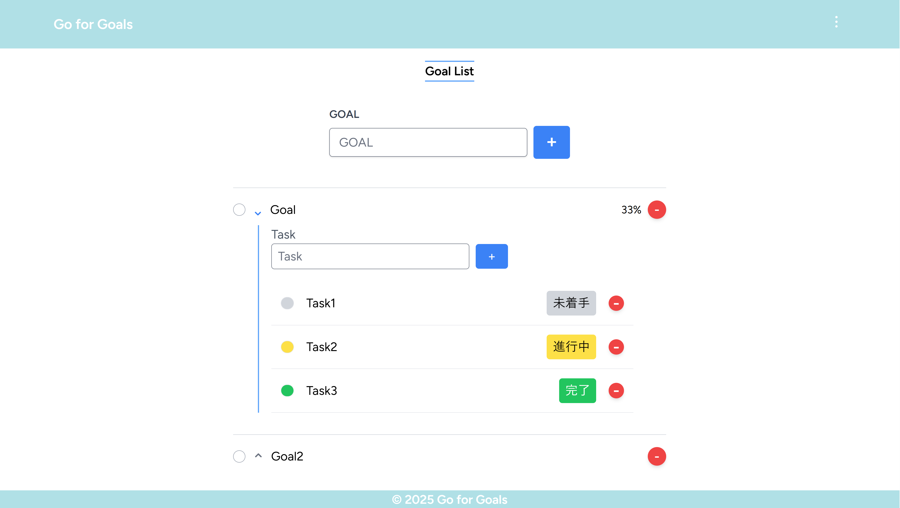
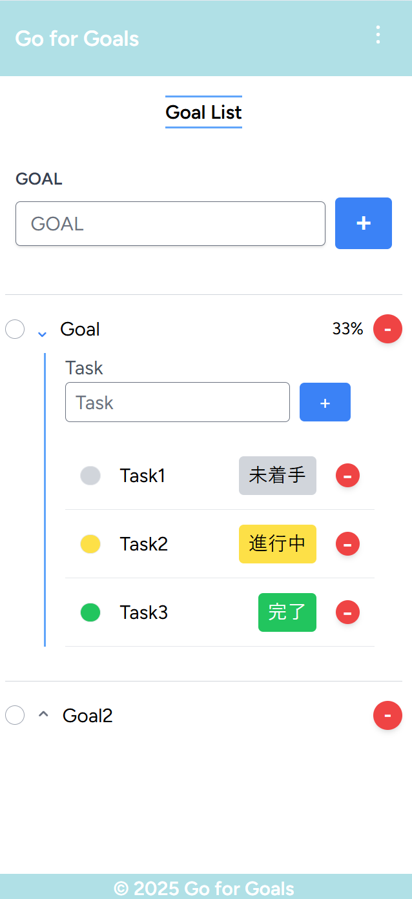

# Goal Task Todo
This is a Todo application that combines goal management and task management.\
目標管理とタスク管理を組み合わせたTodoアプリケーションです。

## 特徴
- 目標とタスクの階層型管理
- ドラッグ＆ドロップでの並び替え
- ゲストモードとユーザーモード
- 多言語対応（日本語・英語）

## スクリーンショット


## 技術スタック
### フロントエンド
- Vue.js 3（Composition API）
- Pinia（状態管理）
- Vue I18n（多言語対応）
- TailwindCSS（スタイリング）

### バックエンド
- Laravel 10
- MySQL 8.0
- PHP 8.2

## 必要要件
- PHP >= 8.2
- Node.js >= 16.0
- Composer
- MySQL

## セットアップ手順
### 1. リポジトリのクローン
```
git clone https://github.com/taroCodesLab/goal-task-todo.git
cd goal-task-todo
```

### 2. 環境設定1
```
cp .env.example .env  
cp my-todo/.env.example my-todo/.env
```

### 3. データベースの設定
MYSQL_PASSWORD=your_password  
DB_PASSWORD=your_password

### 4. 環境構築
```
docker compose up -d --build
```

### 5. コンテナに入って依存関係をインストール
```
docker exec -it mytodo-php bash
composer install
npm install
```

### 6. 環境設定2
```
php artisan key:generate  
php artisan migrate --seed  
npm run dev
```

### 7. アクセス
http://localhost:81 （例）

## 機能説明
### 目標管理
- 目標の追加・編集・削除
- ドラッグ＆ドロップでの優先順位変更
- 進捗率の自動計算

### タスク管理
- タスクの追加・削除
- ステータス管理（未着手・進行中・完了）
- タスク数の制限（ゲストモード）

### ユーザー管理
- ゲストモード：ローカルストレージでデータを保持
- ユーザーモード：データベースでデータを永続化
- ゲストデータのインポート機能

## ライセンス
[MIT License](./LICENSE.md)
